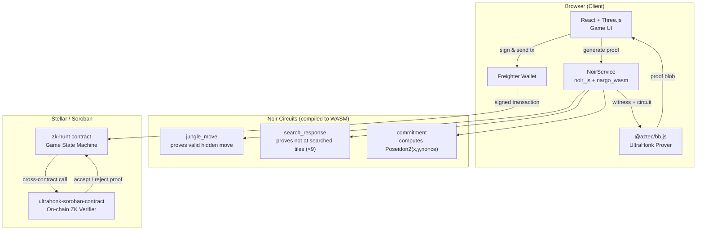

# Phantom Chase

> A zero-knowledge hunter vs. prey game on the Stellar blockchain.

Inspired by **[ZK Hunt: an exploration into the unknown](https://0xparc.org/blog/zk-hunt)** by 0xPARC — the original exploration of cryptographic fog-of-war in on-chain games. Phantom Chase brings those ideas to the Stellar ecosystem using Noir circuits, UltraHonk proofs, and Soroban smart contracts.

---

## What is Phantom Chase?

Phantom Chase is a 1v1 asymmetric strategy game where one player hunts and the other hides. The twist: the prey can become **cryptographically invisible** using zero-knowledge proofs. When the prey enters a jungle tile, their real position is replaced by a Poseidon2 hash commitment — the hunter sees only a ghost, the blockchain knows nothing more.

Every move, every search, every evasion is settled on-chain via Soroban smart contracts on Stellar. No server, no trust — just math.

---


## Local Deployment

### Prerequisites

| Tool | Version | Install |
|------|---------|---------|
| Rust + wasm target | stable | `rustup target add wasm32v1-none` |
| Stellar CLI | latest | [developers.stellar.org/docs/tools/cli](https://developers.stellar.org/docs/tools/cli) |
| Docker | any | [docker.com](https://www.docker.com/) |
| Bun | latest | [bun.sh](https://bun.sh/) |
| nargo | `1.0.0-beta.9` | `noirup -v 1.0.0-beta.9` |
| bb | `0.87.0` | `bbup -v 0.87.0` |

> **nargo and bb versions must match exactly** — they must align with the `@noir-lang/noir_js` and `@aztec/bb.js` versions used by the frontend.

### Deploy

```bash
# 1. Start the local Stellar network (needs Docker running, wait ~30s)
stellar container start local --limits unlimited

# 2. Install JS dependencies
npm install

# 3. Run the full deploy pipeline
#    (compiles circuits, deploys contracts, sets VKs, updates .env)
./deploy.sh

# 4. Start the dev server
bun run dev
```

`deploy.sh` handles everything end-to-end: funding the deployer account, compiling Noir circuits, generating verification keys, deploying the UltraHonk verifier, building and deploying the game contract, uploading VKs on-chain, generating TypeScript bindings, and writing contract IDs to `.env`.

---

## Game Mechanics

### Roles

| Role | Objective |
|------|-----------|
| **Hunter** (drone) | Search the jungle and catch the prey before time runs out |
| **Prey** (mouse) | Evade the hunter and survive all 10 turns |

Roles swap after each round. The player with the most points across all rounds wins.

### Board

An 8×8 grid with two terrain types:

- **Plains** — fully visible. Position is public on-chain.
- **Jungle** — dense cover. Prey hides here using ZK proofs.

### Turn Structure

Each round runs up to **10 turns**. On each turn:

| Phase | Action |
|-------|--------|
| `Hunter Turn` | Hunter moves one tile, searches, uses Max Search, or fires EMP |
| `Prey Turn` | Prey moves one tile — publicly on plains, privately in jungle |
| `Search Pending` | Prey auto-generates a ZK proof they weren't at the searched tiles |

### Scoring

- **Hunter scores** — they step onto the prey's tile, or the prey concedes a search
- **Prey scores** — they survive all 10 turns of the round

---

## Special Abilities

### Hunter

| Ability | Uses | Description |
|---------|------|-------------|
| **Max Search** | 2 / round | Searches all adjacent jungle tiles at once, including diagonals |
| **EMP** | 1 / round | Freezes the visible prey — prey skips their next turn, **hunter still moves this turn** |

### Prey

| Ability | Uses | Description |
|---------|------|-------------|
| **Dash** | 2 / turn | Move 2 tiles at once on plains (only while visible) |

---

## Zero-Knowledge Architecture



### Proof Flow

1. Player triggers an action (enter jungle, move in jungle, respond to search)
2. Frontend calls `NoirService.generateProof()` — loads circuit WASM, generates witness, runs UltraHonk prover (~30–60s)
3. Proof blob is assembled: `u32_be(num_fields) || public_inputs || proof_bytes`
4. Transaction is signed by the wallet and sent to Soroban
5. `zk-hunt` contract forwards the blob to the verifier via cross-contract call
6. Verifier accepts or rejects on-chain; game state advances if valid

---

## ZK Circuits

### `jungle_move`

Proves the prey moved from one hidden jungle position to an adjacent jungle tile.

| | |
|--|--|
| **Public inputs** | `old_commitment`, `new_commitment`, `map_id` |
| **Private inputs** | `old_x`, `old_y`, `old_nonce`, `new_x`, `new_y`, `new_nonce` |

### `search_response`

Proves the prey is **not** at any of the searched tiles (batch of up to 9 — supports full 8-directional power search).

| | |
|--|--|
| **Public inputs** | `commitment`, `searched_x[9]`, `searched_y[9]` |
| **Private inputs** | `my_x`, `my_y`, `my_nonce` |

### `commitment`

Client-side only. Computes `Poseidon2(x, y, nonce)` when the prey first enters jungle.

---

## Tech Stack

| Layer | Technology |
|-------|-----------|
| ZK Circuits | Noir `v1.0.0-beta.9` |
| ZK Prover | Barretenberg / UltraHonk `v0.87.0` |
| On-chain Verifier | `ultrahonk-soroban-contract` (pre-compiled WASM) |
| Smart Contracts | Rust / Soroban SDK `23.1.0` |
| Blockchain | Stellar (local or testnet) |
| Frontend | React 19 + TypeScript + Vite |
| 3D Rendering | React Three Fiber + Drei |
| Wallet | Freighter via `@creit.tech/stellar-wallets-kit` |

---

## How to Play

1. **Player 1** clicks **Create Game** — shares the session ID with the opponent
2. **Player 2** enters the session ID and clicks **Join**
3. The game begins: Hunter moves first
4. Prey enters jungle to go hidden — a ZK proof is generated automatically (~30–60s)
5. Hunter searches tiles; prey auto-responds with a ZK proof they weren't found
6. Roles swap each round — highest score after 2 rounds wins
7. Click **HOW TO PLAY** in the game screen for a full rules reference

---

## Inspiration

Phantom Chase is directly inspired by **[ZK Hunt](https://0xparc.org/blog/zk-hunt)**, an on-chain game built by the [0xPARC](https://0xparc.org) team exploring cryptographic fog-of-war. Their work demonstrated how ZK proofs can give players provable privacy in an otherwise transparent public ledger — a concept we brought to the Stellar ecosystem with Noir circuits and UltraHonk proofs.
